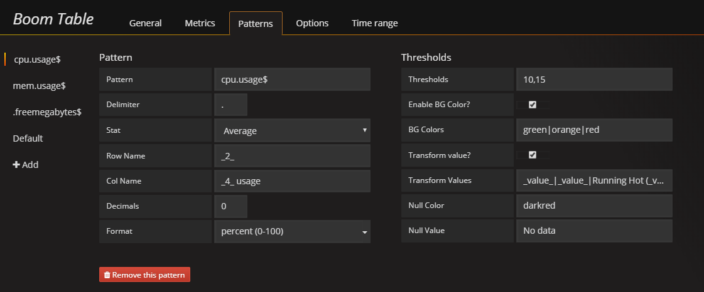
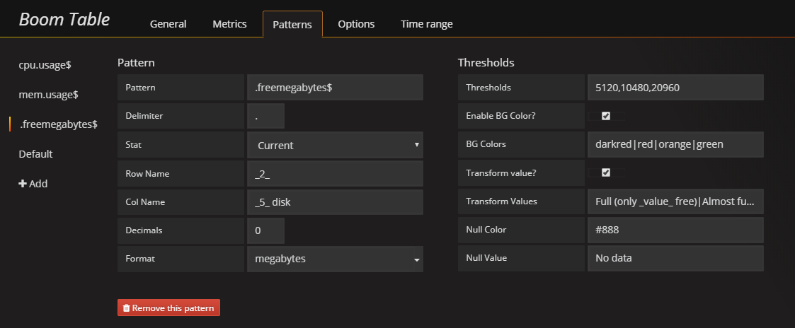
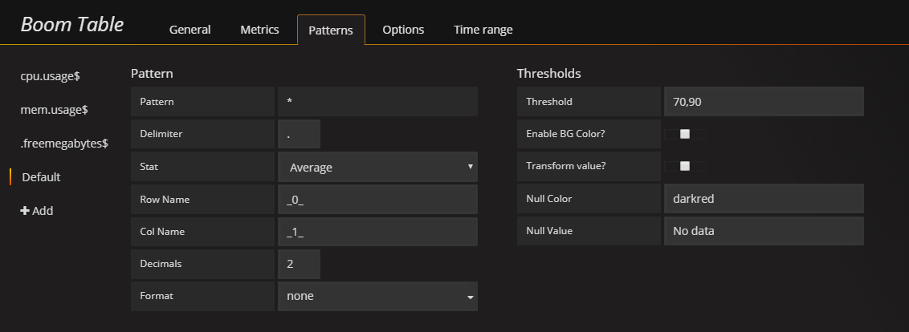

# Boom Table Panel for Grafana

Boom Table Panel for Grafana. Table/MultiStat plugin with multiple columns for Graphite.

Features :
----------

* Multi column support for graphite
* Individual thresholds for cells based on pattern
* Multi level thresholds (N number of thresholds)
* Individual aggregation method for cell based on pattern
* Individual cell values can be transformed to helpful texts, based on pattern.
* Transformed texts can also contain actual metrics
* Units can be set at cell level based on pattern
* Row/Column name based on multiple graphite columns
* Debug UI for patterns

Features Planned / To Do :
------------------------
* Sorting
* Pagination

Supported / Tested Data Sources :
--------------------------------

* Graphite

Screenshots :
-------------

Pattern Editors Sample screenshots

Debug UI Sample screenshots

Metrics screenshots

# Setup

**TLDR** : Use debug mode unless you have time to read the below leeeengthy notes.

Pattern Guidelines
------------------

Pattern are regular expressions / name of the metrics. If there are multiple matching patterns, first match will be considered. To see the matching patterns, enable debug mode in Options panel.

Sample graphite series

    prod.server.my-app-01.sys.cpu.usage
    prod.server.my-app-01.sys.mem.usage
    prod.server.my-app-01.sys.hdd.c.freespace
    prod.server.my-app-01.sys.hdd.d.freespace
    prod.server.my-app-02.sys.cpu.usage
    prod.server.my-app-02.sys.mem.usage
    prod.server.my-app-02.sys.hdd.c.freespace
    prod.server.my-app-02.sys.hdd.d.freespace
    dev.server.my-app-01.sys.cpu.usage
    dev.server.my-app-01.sys.mem.usage
    dev.server.my-app-01.sys.hdd.c.freespace
    dev.server.my-app-01.sys.hdd.d.freespace
    prod.app.sales.usage.requests_per_sec
    prod.app.orders.usage.requests_per_sec
    alias(carbon.agents.a.cache.queries, 'Carbon A usage')
    alias(carbon.agents.b.cache.queries, 'Carbon B usage')

patterns and matching metrics

    usage$ --> All the CPU, Memory metrics from prod and dev and also requests_per_sec metrics and also carbon usage
    cpu.usage$ --> All the CPU metrics
    free --> All the disk freespace metrics
    ^prod --> All the prod metrics
    ^dev.*.usage$ --> All the cpu, mem metrics of dev servers
    ^prod.*.cpu.usage$ --> All the cpu metrics of prod servers
    dev.server.my-app-01.sys.cpu.usage --> only dev.server.my-app-01.sys.cpu.usage
     usage$ --> Carbon usage(Note the space before the pattern)
    A usage$ --> Only carbon A usage

Row and Column name guidelines
------------------------------

Row and Col names are derived from metrics name and value. If x is wrapped by _, then that will be replaced by actual column in graphite metric seperated by delimiter. Refer below examples and screenshots to get more idea. Or use debug mode to try.

Sample graphite series

    prod.server.my-app-01.sys.cpu.usage

Pattern & Output

    _4_                         --> cpu
    _4_ _5_                     --> cpu usage
    _4_ use                     --> cpu use
    Production _4_ usage        --> Production cpu usage
    _1_ _1_                     --> server server

Thresholds 
----------

Thresholds are numbers seperated by comma. There can be multiple thresholds.

Example:

    10,20
    70,90,95

Background color based on thresholds
------------------------------------

Works the same way as single stat panel. Background color is a list of colors seperated by pipe symbol. Colors can be named or hexadecimal colors or rgb or rgba. Number of colors should be greater than the number of thresholds.

Example of color patterns:
     
    green|orange|red
    darkred|red|orange|red
    green|red
    green|#797979|rgba(0, 0, 255,0.5)|rgb(0, 0, 255)|red

Example of matching patterns:

    1:  thresholds  : 5
        pattern     : green|red        
        value       : 5    output  : red
        value       : 6    output  : red
        value       : 4    output  : green

    2:  thresholds  : 70,90
        pattern     : green|orange|red      
        value       : 95    output  : red  
        value       : 85    output  : orange
        value       : 65    output  : green

    3:  thresholds  : 70,90
        pattern     : red|orange|green      
        value       : 95    output  : green  
        value       : 85    output  : orange
        value       : 65    output  : red

Value transformation based on thresholds
----------------------------------------

Logic is same as background color. But the value to be displayed can be altered here. Display value will be replaced with the value provided. Values are seperated by pipe. if the value is wrapped with _, then it will represent the actual value

Example transformation patterns :

    _value_|_value_|_value_
    GOOD|BETTER|BAD
    GOOD (_value_)|_value_|_value
    Time to party|Ill|RIP

Sample value transformation: (Assume your metrics results, 95 and it is percentage data type)
 

    _value_                 -->     95%
    GOOD (_value_)          -->     GOOD (95%)
    HOT (_value_ > threshold of 80%)     -->     HOT (95% > threshold of 80%)
    Contact helpdesk        -->     Contact helpdesk

# ChangeLog

**Version 0.1.0**

* First working version
